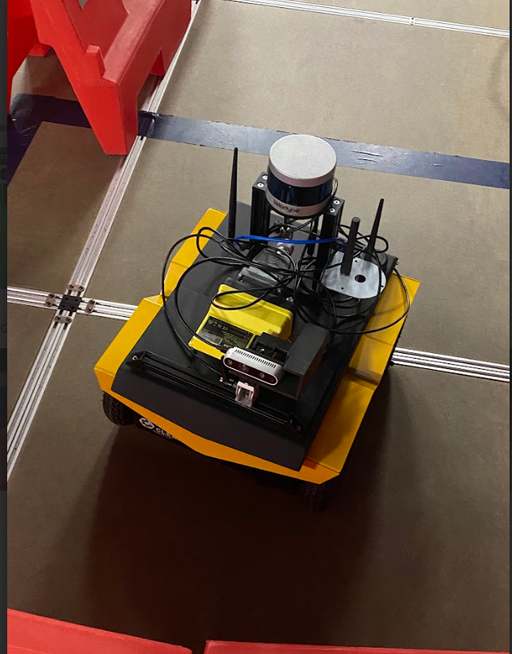
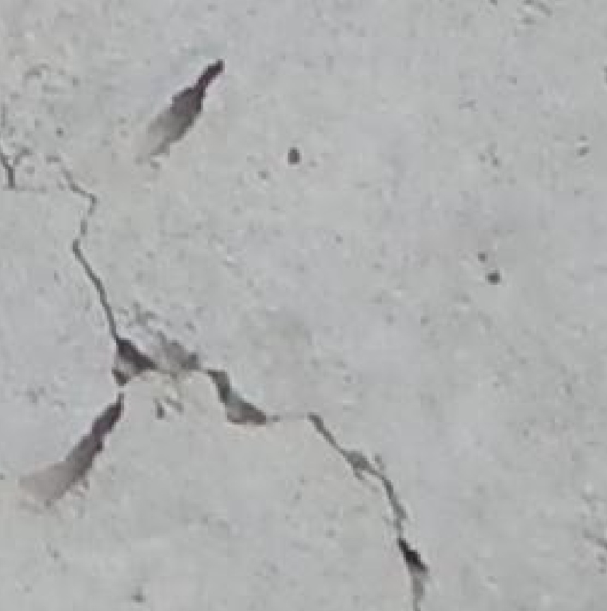
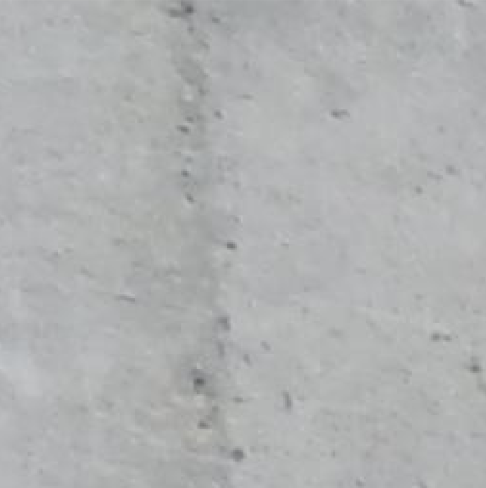
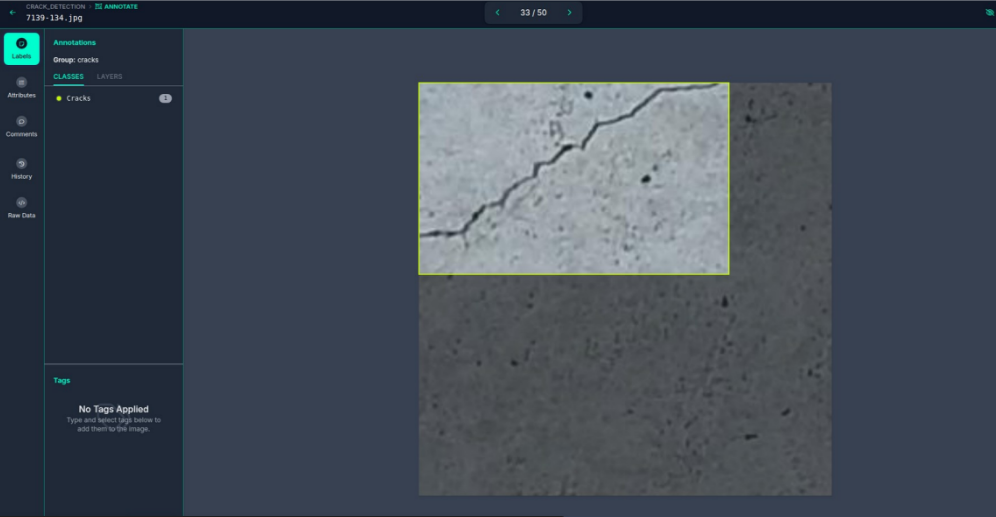
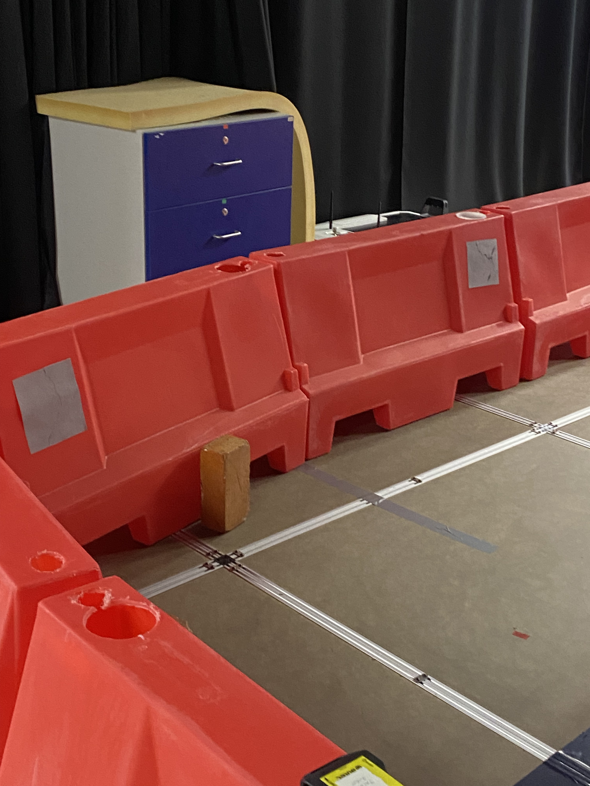
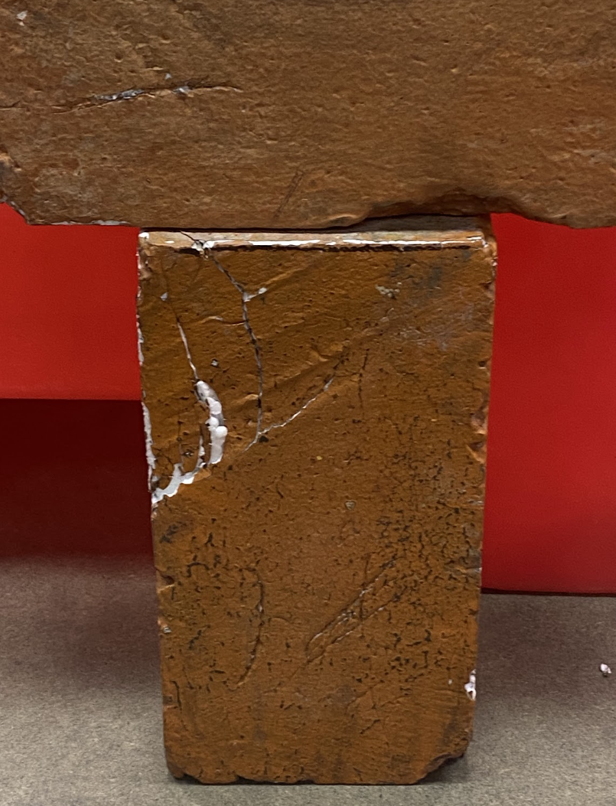
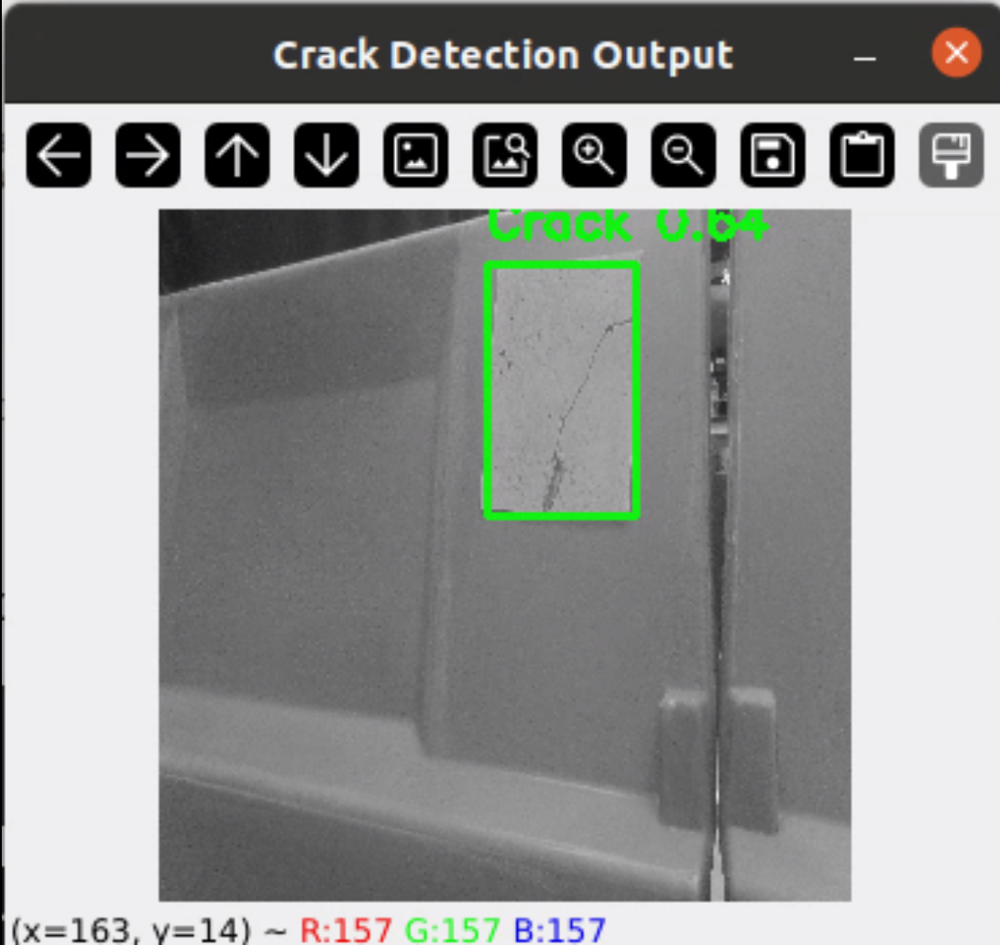

## Crack Detection with YOLOv8
- A project for **detecting cracks in concrete structures** using YOLOv8, implemented with a RealSense camera on a Jackal robot.

## Introduction
- Ensuring the structural health of concrete infrastructures is crucial, especially in **nuclear power plants**, where cracks can lead to catastrophic failures. Traditionally, human inspectors conduct periodic visual assessments, which are time-consuming and risky.
- This project focuses on automating crack detection using an autonomous robotic system, leveraging state-of-the-art deep learning models.
- By integrating **YOLOv8 for real-time crack detection** with the **Jackal and Intel RealSense Camera**, we enable remote, efficient, and continuous monitoring of infrastructure. The **Robot Operating System (ROS)** facilitates robot control and real-time data collection, allowing seamless deployment in hazardous environments.
- The goal is to **improve the safety and efficiency of infrastructure inspection** by enabling autonomous crack detection and monitoring.


- The system utilizes:
  - **YOLOv8** for real-time crack detection.
  - **Jackal UGV** 
    with an Intel RealSense Camera for autonomous movement and data collection.
    
  - **ROS (Robot Operating System)** for robot control.

## Benefits
- This project also explores **Human-Robot Interaction (HRI)** by examining how robotic-assisted inspections can complement and **improve human's safety.**
- The key benefits include:

  - Enhanced Inspection Capabilities:
    The robot autonomously navigates through structures and detects cracks in real-time, providing live feedback to human operators.

  - Operator-Assisted Control:
    Instead of fully replacing human inspectors, the robot serves as an intelligent assistant, helping experts focus on analyzing critical defects rather than performing repetitive manual     inspections.

  - Increased Safety & Reduced Exposure:
    In high-risk environments, such as nuclear power plants, oil refineries, or bridges, sending a robot for preliminary inspections minimizes human exposure to radioactive or structurally compromised areas.

## Project Structure
- **Crack-Detection-YOLOv8/**
  - `dataset/` - Contains images and labels
  - `models/` - Trained YOLOv8 models
  - `outputs/` - Inference results
  - `runs/` - YOLO training logs
  - `scripts/` - Supporting scripts
  - `data.yaml` - YOLO dataset configuration
  - `jackal_flowchart.py` - Experiment visualization
  - `prepare_dataset.py` - Dataset preprocessing
  - `preprocess_images.py` - Image preprocessing script
  - `yolov8n.pt` - YOLOv8 pre-trained model
  - `README.md` - Project documentation


## To set up the environment:
- Clone the repository:
  ```
  git clone https://github.com/xxyeonxx/Crack-Detection-YOLOv8.git
  cd Crack-Detection-YOLOv8
  ```
- Install dependencies:
  ```
  pip install -r requirements.txt  # If applicable
  ```


## Dataset
- The dataset consists of 500 images, including cracked and uncracked surfaces. Images were labeled using Roboflow.
  - Example of Cracked image :
    
    
    
  - Example of Un-cracked image :
    
    

- **Dataset Source**
  - Dorafshan, S., Thomas, R. J., & Maguire, M. (2018). SDNET2018: A Concrete Crack Image Dataset for Machine Learning Applications.
    ```
    https://digitalcommons.usu.edu/all_datasets/48/
    ```
    

- **Dataset Structure** (YOLO format):
```
dataset/
├── train/
│   ├── images/
│   └── labels/
└── val/
    ├── images/
    └── labels/
``` 

- **Labels**: YOLO format (`data.yaml`):
```yaml
train: dataset/train/images
val: dataset/val/images
nc: 1
names: ["Cracks"]
```
## Annotations
Manual annotation with Roboflow, labeling cracks with bounding boxes.
(Class : Crack)


## Training
-  To train the YOLOv8 model, run:
  
  ```
  yolo train data=data.yaml model=yolov8n.pt epochs=150 imgsz=256
  ```

-  Parameters
  
    - **Epochs**: The number of training iterations.
        - A higher number generally improves accuracy, but too many can lead to overfitting.
        - Try epochs=50 for a quick test.
        - Use epochs=100 for balanced training.
        - **epochs=150** was chosen for the best performance in this project.
    
    - **Image Size (imgsz)**
    : A smaller image size (e.g., imgsz=256) speeds up training and inference while still capturing enough details for crack detection.
      The original dataset contained **256x256** images, so resizing larger (e.g., 640x640) caused distortions and poor performance in early trials.
      Using 256x256 improved accuracy while maintaining efficiency.
    
## Results

| Trial  | Image Size | Epochs | Precision | Recall | mAP@50 | mAP@50-95 |
|--------|-----------|--------|-----------|--------|--------|-----------|
| First  | 640x640   |  50    |  0.65     |  0.52  |  0.55  |  0.30     |
| Second | 256x256   | 100    |  0.71     |  0.58  |  0.68  |  0.48     |
| Third  | 256x256   | 150    |  0.81     |  0.65  |  0.73  |  0.52     |

- **Precision**: Measures how many of the detected cracks are actually cracks.
- **Recall**: Measures how many actual cracks were detected.
- **mAP@50**: Mean Average Precision at IoU 0.5 (general accuracy).
- **mAP@50-95**: Mean Average Precision across different IoU thresholds (stricter accuracy).

 *The third trial performed the best with higher precision and recall!* 

## Experiments
: This experiment was designed to evaluate the real-time crack detection capabilities of YOLOv8 when implemented on a Jackal UGV (Unmanned Ground Vehicle) with an Intel RealSense camera.

**1. Set-up the Environment**
  - To create a controlled test area for evaluating the crack detection model, I designed an experimental setup that mimics a real-world inspection scenario.
  - This includes:
    - Model Concrete Bricks: Placed within the test environment, some with visible cracks and others without.
    - Printed Crack Images: Since the dataset was limited, I attached printed images of cracks to barriers to simulate various crack types and test model accuracy.
      

**2. Expanding the Dataset**
  - To improve model performance and reduce false detections:

    - Collected additional real-world images of cracked and uncracked surfaces.
       
    - Captured images of the model bricks in the lab environment.
    - Uploaded and annotated them in Roboflow to integrate them into the existing dataset.
    - Re-trained the model after dataset expansion.
    - 
**3. Preparing the Jackal Robot**
  - Joystick Setup:
    The Jackal robot was controlled via a joystick, launch the teleoperation script using:
    ```
    roslaunch jackal_control teleop.launch
    ```
  - Camera Activation:
    The Intel RealSense camera provided real-time RGB video feed for YOLO inference.

**4. Involving Participants**
  - To assess the usability of the system, I included human interaction in two roles:

    - Operator: Controlling Jackal via the joystick, navigating the robot to inspect surfaces.
    - Observer/Monitor: Analyzing the detection results displayed on the screen in real time.
      
**5. Running the Crack Detection Model**
  - To start real-time crack detection on Jackal, run:
   
     ```
     python3 crack_detection.py
     ```
  - This script:
      - Captures real-time video from the Intel RealSense Camera.
      - Runs YOLOv8 inference on each frame.
      - Displays detected cracks with bounding boxes.

**6. Evaluating Performance**
  - Example of crack detection output:
    
    
  - To assess the effectiveness of the trained YOLOv8 model for real-time crack detection, we defined several evaluation criteria and designed a participant survey to gather qualitative feedback.

    **(1) Crack Detection Accuracy**
      - Can the model correctly identify cracks on the model bricks?
      - Does it successfully distinguish between cracked and uncracked surfaces?
      - Does it mistakenly detect non-crack elements (e.g., hands, shadows, textures) as cracks?

    **(2) Detection Confidence and Consistency**
      - Does the confidence score (e.g., 0.55 threshold) correlate with actual crack presence?
      - How well does the model perform under different lighting conditions?
      - Does the detection vary based on the distance or angle of the RealSense camera?
        
    **(3) Real-time Processing & Computational Efficiency**
      - Can the model run smoothly on the Jackal's onboard processing unit?
      - Does increasing the confidence threshold improve accuracy without sacrificing detection speed?
   
**7. Participants' Feedback**
  - To evaluate the **human-robot interaction aspect**, you can design a set of questions for participants who controlled the Jackal and monitored the detection output.
    
    **(1) Ease of Control & Navigation (Operator)**
       - Did you feel the robot responded accurately to your inputs?
       - Were there any difficulties in positioning the robot to inspect cracks?
       - Would you suggest an alternative control method?
    
    **(2) Visibility & Detection Feedback (Monitor/Observer)**
       - Was the real-time detection display clear and informative?
       - Was it easy to interpret the model’s confidence scores (e.g., high/low detection thresholds)?
       - Did the system provide sufficient information for decision-making?
       - Should additional features like crack size estimation or severity ranking be added?


## Conclusion
  - This project demonstrated how robotic automation can enhance safety and efficiency in infrastructure inspections, reducing the need for direct human exposure to hazardous environments. As advancements in AI, robotics, and computer vision continue, the integration of autonomous systems like this will play a crucial role in ensuring the safety and longevity of critical structures like nuclear power plants.
  - With further improvements, this technology could contribute significantly to the field of structural health monitoring, industrial safety, and human-robot collaboration.


